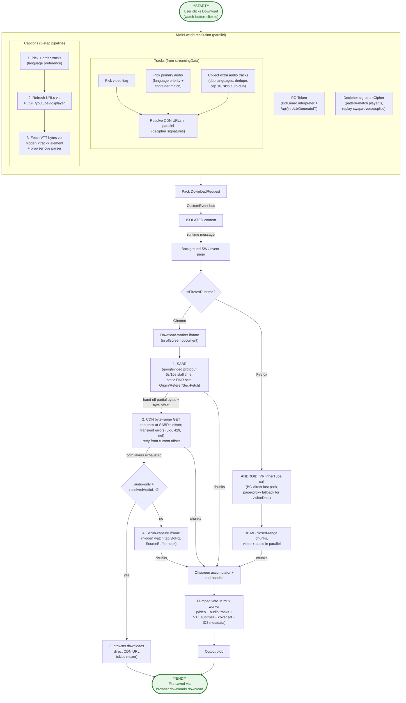
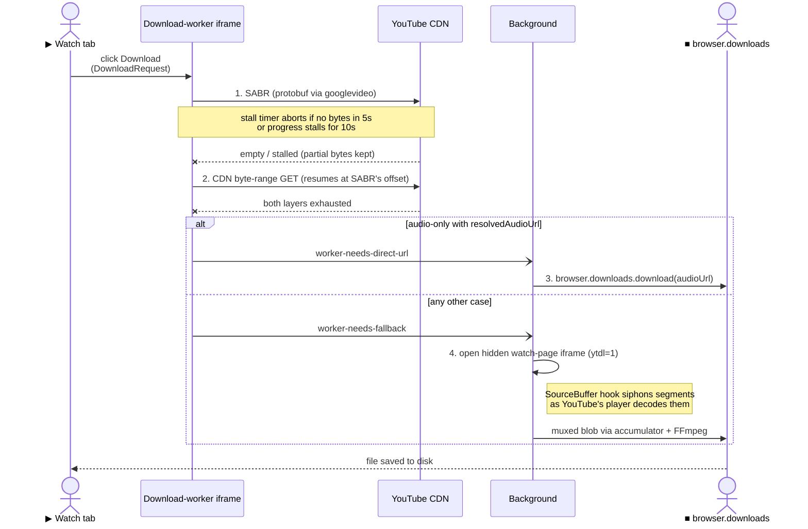
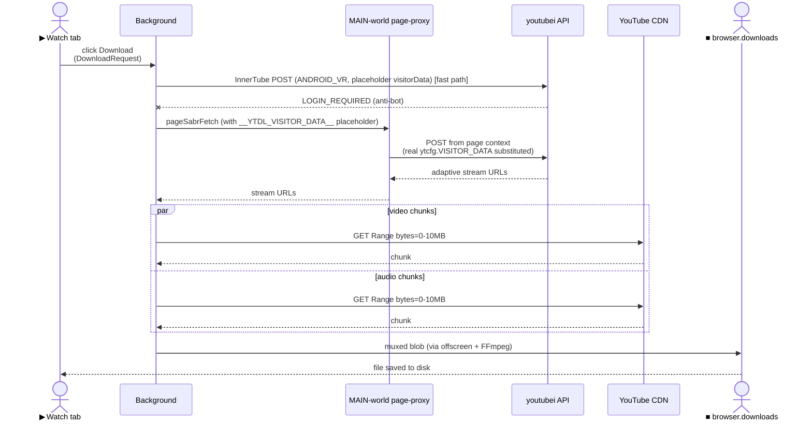
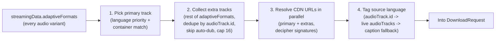
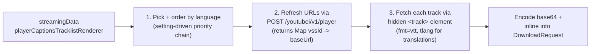
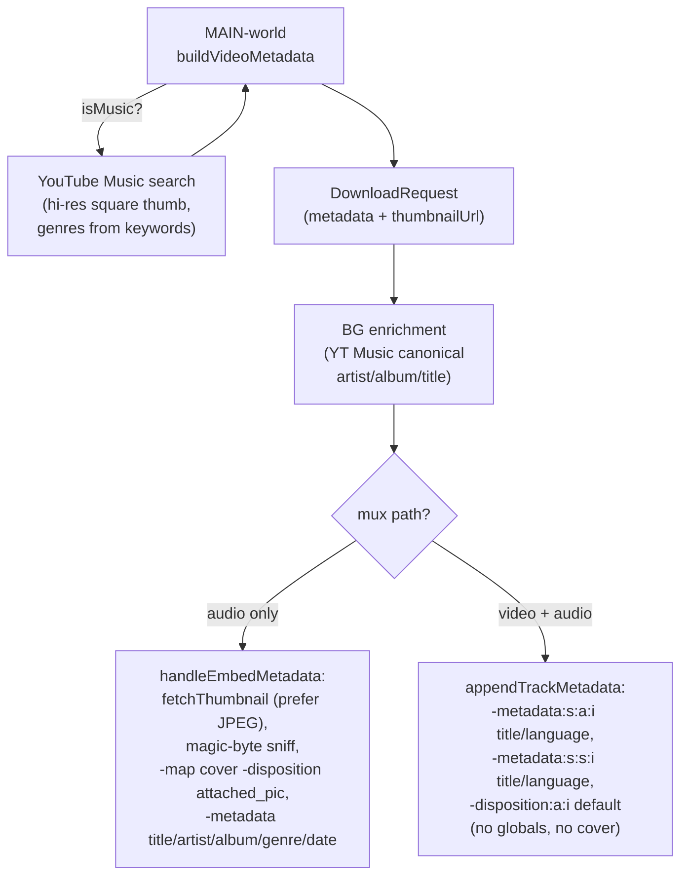

# Architecture

A guide for contributors. The README explains *what* this extension does and how to install it. This document explains *how* it's put together and which constraints shape the design — enough to find your way around the code without reading every file.

The central constraint shaping everything: MV3 fragments execution across isolated runtimes that can't share memory, and the YouTube stream protocol that actually delivers bytes (SABR) is gated by a cryptographic challenge that only the page's own JavaScript can solve. So the architecture is a relay race — page context resolves auth and URLs, the background orchestrates, the offscreen document holds the heavy runtimes (FFmpeg WASM, sandboxed download iframes), and a small handful of typed buses move state between them.

## System diagram

**Where each step lives**

| Diagram node | Code |
| --- | --- |
| User clicks Download | [`watch-button-click.ts:30`](layers/youtube/entrypoints/youtube-main.content/watch-button/watch-button-click.ts) `buildClickHandler` |
| Pick video itag + audio tracks | [`download-formats.ts:75`](layers/youtube/entrypoints/youtube-main.content/video/download-formats.ts) `selectFormats` + [`:15`](layers/youtube/entrypoints/youtube-main.content/video/download-formats.ts) `getExtraAudioFormats` |
| Pick primary audio (language + container) | [`select-audio-format.ts:32`](src/lib/youtube/select-audio-format.ts) `selectPreferredAudioFormat` |
| Resolve CDN URLs (decipher signatures) | [`download-formats.ts:106`](layers/youtube/entrypoints/youtube-main.content/video/download-formats.ts) `preResolveCdnUrls` -> [`stream-fetch.ts`](layers/youtube/entrypoints/youtube-main.content/video/stream-fetch.ts) `resolveFormatUrl` |
| PO token (BotGuard + GenerateIT) | [`po-token-generator.ts:32`](layers/youtube/lib/youtube/po-token-generator.ts) `generatePoToken` (driving [`botguard-vm.ts`](layers/youtube/lib/youtube/botguard-vm.ts)) |
| Decipher signatureCipher | [`signature-decryptor.ts:61`](layers/youtube/lib/youtube/signature-decryptor.ts) `decryptSignatureCipher` + [`signature-transforms.ts`](layers/youtube/lib/youtube/signature-transforms.ts) |
| 1. Pick + order caption tracks | [`caption-urls.ts:20`](layers/youtube/entrypoints/youtube-main.content/video/caption-urls.ts) `resolveOrderedCaptionTracks` + [`caption-helpers.ts:29`](src/lib/youtube/caption-helpers.ts) `orderCaptionsByPreference` |
| 2. Refresh caption URLs via InnerTube | [`caption-urls.ts:47`](layers/youtube/entrypoints/youtube-main.content/video/caption-urls.ts) `fetchFreshCaptionUrls` |
| 3. Fetch VTT bytes via `<track>` | [`caption-fetch.ts:88`](layers/youtube/entrypoints/youtube-main.content/video/caption-fetch.ts) `fetchCaptionWebVttData` |
| Pack DownloadRequest | [`download-request-builder.ts:79`](layers/youtube/entrypoints/youtube-main.content/video/download-request-builder.ts) `buildEnrichedRequest` |
| Cross-world CustomEvent bus | [`cross-world-messenger.ts`](src/lib/messaging/cross-world-messenger.ts) `crossWorldMessenger` |
| ISOLATED content runtime bridge | [`cross-world-download.ts:8`](layers/youtube/entrypoints/youtube.content/handlers/cross-world-download.ts) `registerDownloadProgressHandlers` |
| Background SW / event-page entry | [`background/main.ts:23`](layers/background/main.ts) `main` (wrapped by `defineBackground` in the [`src/entrypoints/background.ts`](src/entrypoints/background.ts) stub) |
| `isFirefoxRuntime?` probe | [`background-downloader.ts:37`](layers/background/download/background-downloader.ts) `isFirefoxRuntime` |
| Dispatch to worker iframe vs Firefox path | [`background-downloader.ts:361`](layers/background/download/background-downloader.ts) `startBackgroundDownload` |
| Download-worker iframe entry | [`download-worker/main.ts:24`](layers/processing/entrypoints/download-worker/main.ts) (message handler) |
| ANDROID_VR InnerTube call | [`android-player.ts:127`](layers/background/lib/youtube/android-player.ts) `resolveAndroidUrls` |
| Firefox page-proxy fallback | [`page-sabr-fetch.content.ts:23`](layers/youtube/entrypoints/page-sabr-fetch.content.ts) `readVisitorData` + [`:38`](layers/youtube/entrypoints/page-sabr-fetch.content.ts) `substituteBodyTokens` (bridged via [`page-sabr-fetch-bridge.ts:13`](layers/youtube/entrypoints/youtube.content/handlers/page-sabr-fetch-bridge.ts) `registerPageSabrFetchBridge`) |
| 1. SABR fetch loop | [`sabr-downloader.ts:24`](layers/background/download/sabr-downloader.ts) `downloadViaSabr` (stall timer in [`sabr-stall-timer.ts`](layers/background/download/sabr-stall-timer.ts)) |
| 2. CDN byte-range GET | [`cdn-downloader.ts:43`](layers/background/download/cdn-downloader.ts) `downloadViaCdn` (range fetch in [`cdn-fetch.ts:61`](layers/background/download/cdn-fetch.ts) `fetchWithProgress`) |
| 3. Direct CDN URL via browser.downloads | [`download-handlers.ts:111`](layers/background/handlers/download-handlers.ts) |
| 4. Scrub-capture iframe | [`iframe-downloader.ts:31`](layers/background/download/iframe-downloader.ts) `prepareIframe` + [`:70`](layers/background/download/iframe-downloader.ts) `downloadViaWatchPage` (SourceBuffer hook in [`sourcebuffer-capture-patches.ts:34`](layers/youtube/entrypoints/sourcebuffer-capture/sourcebuffer-capture-patches.ts) `patchSourceBuffer`) |
| Firefox 10 MB chunked fetch | [`firefox-direct-download.ts:264`](layers/background/download/firefox-direct-download.ts) `runFirefoxDirectDownload` |
| Offscreen accumulator + end-handler | [`accumulator.ts`](layers/processing/entrypoints/offscreen/stream/accumulator.ts) + [`end-handler.ts:8`](layers/processing/entrypoints/offscreen/stream/end-handler.ts) `handleProcessStreamEnd` |
| FFmpeg WASM mux worker | [`mux-worker/index.ts:23`](layers/processing/entrypoints/mux-worker/index.ts) `onInitMessage` + [`mux-handler-mux-video-audio.ts`](layers/processing/entrypoints/mux-worker/mux-handler-mux-video-audio.ts) |
| File saved via browser.downloads.download | [`download-fallback-chain.ts:75`](layers/background/download/download-fallback-chain.ts) |
| DNR `Origin`/`Referer`/`Sec-Fetch` rewrite on `googlevideo` | static ruleset [`strip-youtube-frame-headers.json`](src/public/rules/strip-youtube-frame-headers.json) (registered via `declarative_net_request` in [`wxt.config.ts`](wxt.config.ts)) |

Chrome and Firefox diverge only at `isFirefoxRuntime?`. Everything that runs in MAIN context before the dispatch (auth, itags, captions) and everything after the chunks reach the accumulator (muxing, blob creation, `browser.downloads`) is shared code. The two sequence diagrams further down zoom into the Chrome 4-layer fallback chain and the Firefox page-proxy hand-off.

## Codemap

The code is organised as WXT layers under `layers/` — `layers/background` (service-worker logic + its private lib), `layers/popup` (popup UI), `layers/processing` (offscreen document + workers), `layers/youtube` (content scripts + Svelte components + page-context lib) — on top of a shared core under `src/` (`lib/`, `types/`, `public/`, plus the thin background stub entrypoint at `src/entrypoints/background.ts`). Layers import shared code via the `@/` alias and their own files via `#<layer>/`. Each directory below owns one leg of the relay.

| Path | Role |
| --- | --- |
| `layers/youtube/entrypoints/youtube-main.content/` | MAIN-world content scripts. Reads Polymer state, builds the `DownloadRequest`, runs BotGuard / generates PO tokens, watches player events. |
| `layers/youtube/entrypoints/youtube.content/` | ISOLATED-world content. Bridges page-context messages to `browser.runtime`. |
| `layers/youtube/entrypoints/page-sabr-fetch.content.ts` | MAIN-world bridge that runs page-context pristine `fetch` for the Firefox InnerTube path. |
| `layers/youtube/entrypoints/sourcebuffer-capture/` | MAIN-world script that patches `SourceBuffer.appendBuffer` on the scrub-capture iframe to siphon decoded segments. |
| `layers/background/` | Dispatcher, download orchestration, fallback chain, retry / queue / tab-tracking, progress routing. |
| `layers/processing/entrypoints/offscreen/` | Offscreen document. Hosts FFmpeg WASM (which the SW can't run), the download-worker iframe, and the scrub-capture iframe. On Firefox the offscreen "document" is a hidden iframe in the BG event-page's own document, but the URL is the same. |
| `layers/processing/entrypoints/download-worker/` | Sandboxed iframe inside the offscreen document. Runs Chrome's SABR + CDN fetch loop in isolation from the BG SW. |
| `layers/processing/entrypoints/mux-worker/` | Web Worker that drives `@ffmpeg/core` to mux video + audio + subtitles + cover art. |
| `layers/popup/entrypoints/popup/` | Browser-action popup. Download history (IndexedDB + blob store), live progress, format-change dialog, settings. |
| `src/lib/youtube/` | Shared YouTube-specific knowledge: Innertube schemas, SABR protocol, format helpers. |
| `layers/youtube/lib/youtube/` | Page-context YouTube knowledge: BotGuard / PO token, signature decryptor, `ytcfg`, playlist fetch. |
| `src/lib/messaging/` | Typed buses: cross-world between MAIN and ISOLATED via `CustomEvent`; runtime between content and BG; offscreen between BG and offscreen via `MessagePort`; window between page and extension via `window.postMessage`. |
| `src/lib/download-pipeline/` | Browser-agnostic post-fetch pipeline: stream processor, mux job builder, FFmpeg instance, blob download, recent-downloads store. |
| `src/lib/storage/` | `wxt/storage`-backed items with per-item mutation locks, plus the recent-downloads IndexedDB store (entries + blob cache, quota eviction). |
| `layers/background/lib/analytics/` | GA4 Measurement Protocol telemetry (active-user heartbeat + install/uninstall), fired from the BG with no host permissions. |
| `src/lib/ui/` | Svelte 5 stores and reactive helpers shared across content scripts and popup. |
| `layers/youtube/components/` | Svelte 5 components. |
| `wxt.config.ts` | Manifest emission, including the `declarative_net_request` ruleset reference. The rules themselves live in [`src/public/rules/strip-youtube-frame-headers.json`](src/public/rules/strip-youtube-frame-headers.json) and rewrite `Origin`/`Referer`/`Sec-Fetch` on outgoing `googlevideo.com` requests (the SW can't set them itself). |

## Architectural invariants

These are the rules the rest of the code relies on. Many are "absence of something" and impossible to recover from reading source alone, which is why they live here.

- **MAIN world resolves, background fetches.** Every piece of YouTube state (itags, SABR config, PO token, fresh caption URLs, dubbing tracks) is gathered in the MAIN-world content script and packed into a single [`DownloadRequest`](src/types/domain-types.ts) *before* any cross-context message is sent (see [`buildEnrichedRequest`](layers/youtube/entrypoints/youtube-main.content/video/download-request-builder.ts)). The background never reads page state.
- **The background SW never touches stream bytes on Chrome.** All network I/O for streams happens inside the [download-worker iframe](layers/processing/entrypoints/download-worker/main.ts) or the [scrub-capture iframe](layers/youtube/entrypoints/sourcebuffer-capture/sourcebuffer-capture-patches.ts). The SW only orchestrates.
- **One [`DownloadProgressEntry`](src/types/domain-types.ts) shape across every surface.** Watch button (MAIN), in-tab UI (ISOLATED), and popup (separate document) all read the same shape — the first two from a cross-world `CustomEvent` store ([`downloadProgressStore`](src/lib/ui/synced-stores.svelte.ts)), the popup from `chrome.storage.local` via [`statusProgressItem`](src/lib/storage/storage.ts).
- **One browser-discriminator function, used everywhere.** [`isFirefoxRuntime()`](layers/background/download/background-downloader.ts) probes `typeof browser.offscreen === "undefined"`. There are no per-feature browser checks.
- **The offscreen "document" is the same page on both browsers.** Chrome uses `chrome.offscreen.createDocument()`; Firefox appends a hidden iframe with the same URL into the BG event-page's own document. Both paths fan in through [`ensureProcessor`](layers/background/handlers/processor.ts); everything downstream is shared code.
- **`Origin: youtube.com` comes back via the network layer, not via code.** A static [DNR ruleset](src/public/rules/strip-youtube-frame-headers.json) rewrites `Origin`/`Referer`/`Sec-Fetch` on every outbound `googlevideo.com` request. No callsite has to remember to set them, and there is no runtime rule registration.
- **The Firefox InnerTube call must originate from the page.** The `visitorData` blob YouTube validates only exists in `ytcfg`; pulling it from extension context fails the anti-bot gate. The [page-proxy bridge](layers/youtube/entrypoints/youtube.content/handlers/page-sabr-fetch-bridge.ts) (`registerPageSabrFetchBridge`) runs the fetch from a [MAIN-world iframe](layers/youtube/entrypoints/page-sabr-fetch.content.ts) (`substituteBodyTokens`) so the request appears same-origin.
- **403 is terminal; 5xx and 429 are transient.** Auto-retry fires only for the transient set ([`isRecoverableError`](layers/background/download/network-retry.ts)). Retrying a 403 just wastes the retry budget.
- **Manual cancels propagate to every level atomically.** [`performCancelDownload`](src/lib/ui/cancel-download.ts) drives worker iframe abort, offscreen accumulator drop, mux queue cancel marker, and persisted-retry deletion — all keyed off the same `videoId`. A cancelled download is never resurrected by a stale retry.
- **The Retry button is for unrecoverable errors only.** Auto-retry handles 5xx / 429 / network reset / stall silently (5 s / 20 s / 60 s backoff, 3 attempts) via [`scheduleAutoRetry`](layers/background/download/network-retry.ts). If the user sees Retry, the failure is a class that a fresh attempt can't fix on its own — FFmpeg mux failure, codec parse error, attestation wall, OPFS write error.
- **zod runs jitless because the YouTube page enforces Trusted Types.** MAIN-world code can't use the `eval`/`Function` that zod's schema JIT relies on, so every schema imports `z` from [`src/lib/zod.ts`](src/lib/zod.ts), which calls `z.config({ jitless: true })` once. Importing `zod` directly throws on a YouTube page.
- **Recent-download caching is best-effort and never blocks the save.** [`addRecentDownload`](src/lib/storage/recent-downloads-db.ts) evicts the oldest cached entries to fit under the (unlimited-but-disk-bound) quota and returns `false` to skip rather than throwing; the actual `browser.downloads` save in [`persistAndTrigger`](src/lib/download-pipeline/blob-download.ts) always runs regardless. Cached entries live for 10 minutes, a window that resets whenever the popup closes.

## Deep dives

These three sections are the parts of the system that are most non-obvious and most worth understanding before changing code.

### Chrome stream fetch — four-layer fallback chain

**Where each step lives**

| Sequence step | Code |
| --- | --- |
| Click Download (DownloadRequest packed) | [`watch-button-click.ts:30`](layers/youtube/entrypoints/youtube-main.content/watch-button/watch-button-click.ts) `buildClickHandler` -> [`download-request-builder.ts:79`](layers/youtube/entrypoints/youtube-main.content/video/download-request-builder.ts) `buildEnrichedRequest` |
| Worker receives request | [`download-worker/main.ts:24`](layers/processing/entrypoints/download-worker/main.ts) (message handler) |
| 1. SABR (protobuf via googlevideo) | [`sabr-downloader.ts:24`](layers/background/download/sabr-downloader.ts) `downloadViaSabr` |
| Stall timer (5 s / 10 s) | [`sabr-stall-timer.ts`](layers/background/download/sabr-stall-timer.ts) `createSabrStallTimer` |
| 2. CDN byte-range GET (resumes at offset) | [`cdn-downloader.ts:43`](layers/background/download/cdn-downloader.ts) `downloadViaCdn` |
| `worker-needs-direct-url` message | constant in [`download-worker/main.ts:13`](layers/processing/entrypoints/download-worker/main.ts); handled in [`download-handlers.ts`](layers/background/handlers/download-handlers.ts) |
| 3. browser.downloads.download(audioUrl) | [`download-handlers.ts:111`](layers/background/handlers/download-handlers.ts) |
| `worker-needs-fallback` message | constant in [`download-worker/main.ts:14`](layers/processing/entrypoints/download-worker/main.ts) |
| 4. Open hidden watch-page iframe (ytdl=1) | [`iframe-downloader.ts:31`](layers/background/download/iframe-downloader.ts) `prepareIframe` + [`:70`](layers/background/download/iframe-downloader.ts) `downloadViaWatchPage` |
| SourceBuffer hook siphons segments | [`sourcebuffer-capture-patches.ts:34`](layers/youtube/entrypoints/sourcebuffer-capture/sourcebuffer-capture-patches.ts) `patchSourceBuffer` |
| Muxed blob via accumulator + FFmpeg | [`end-handler.ts:8`](layers/processing/entrypoints/offscreen/stream/end-handler.ts) `handleProcessStreamEnd` -> [`mux-worker/index.ts:23`](layers/processing/entrypoints/mux-worker/index.ts) `onInitMessage` |

The Chrome path walks four layers, each only invoked when the one above returns no usable bytes.

1. **SABR.** YouTube's internal adaptive streaming protocol, spoken via `googlevideo`. The download-worker iframe constructs protobuf requests the CDN accepts as a real player session ([`downloadViaSabr`](layers/background/download/sabr-downloader.ts)). A [stall timer](layers/background/download/sabr-stall-timer.ts) aborts and yields to layer 2 if no bytes arrive within 5 s, or progress stalls for 10 s.
2. **CDN.** Plain HTTPS byte-range fetches against the resolved adaptive URL ([`downloadViaCdn`](layers/background/download/cdn-downloader.ts), with [`fetchWithProgress`](layers/background/download/cdn-fetch.ts) handling the ranged fetch). A dropped connection resumes from the offset rather than restarting.
3. **Direct CDN URL via `browser.downloads`.** Audio-only path only. If the worker has a `resolvedAudioUrl`, the [BG handler](layers/background/handlers/download-handlers.ts) hands the URL straight to `browser.downloads.download` and skips muxing. If even this fails (transient block, expired signature), it falls through to layer 4.
4. **Watch-page scrub-capture.** Last resort. The background opens a hidden `<iframe src="youtube.com/watch?v={id}&ytdl=1&mute=1&autoplay=1">` inside the offscreen document ([`prepareIframe`](layers/background/download/iframe-downloader.ts) -> [`downloadViaWatchPage`](layers/background/download/iframe-downloader.ts)). A [MAIN-world content script](layers/youtube/entrypoints/sourcebuffer-capture/sourcebuffer-capture-patches.ts) (`patchSourceBuffer`) patches `MediaSource.addSourceBuffer` and `SourceBuffer.appendBuffer` to siphon every video and audio segment as YouTube's own player decodes the stream into its media element. Up to two fresh-iframe retries before reporting failure.

Captured bytes from every layer flow into the same [offscreen accumulator](layers/processing/entrypoints/offscreen/stream/accumulator.ts), so muxing is identical regardless of which layer produced them.

### Firefox stream fetch — `ANDROID_VR` bypass

**Where each step lives**

| Sequence step | Code |
| --- | --- |
| Click Download (DownloadRequest packed) | [`watch-button-click.ts:30`](layers/youtube/entrypoints/youtube-main.content/watch-button/watch-button-click.ts) `buildClickHandler` -> [`download-request-builder.ts:79`](layers/youtube/entrypoints/youtube-main.content/video/download-request-builder.ts) `buildEnrichedRequest` |
| BG dispatches Firefox path | [`background-downloader.ts:361`](layers/background/download/background-downloader.ts) `startBackgroundDownload` (probe at [`:37`](layers/background/download/background-downloader.ts) `isFirefoxRuntime`) |
| InnerTube POST (ANDROID_VR) fast path | [`android-player.ts:127`](layers/background/lib/youtube/android-player.ts) `resolveAndroidUrls` |
| `pageSabrFetch` bridge (visitorData placeholder) | [`page-sabr-fetch-bridge.ts:13`](layers/youtube/entrypoints/youtube.content/handlers/page-sabr-fetch-bridge.ts) `registerPageSabrFetchBridge` |
| Page-context POST (placeholder substituted) | [`page-sabr-fetch.content.ts:38`](layers/youtube/entrypoints/page-sabr-fetch.content.ts) `substituteBodyTokens` (reads via [`:23`](layers/youtube/entrypoints/page-sabr-fetch.content.ts) `readVisitorData`) |
| 10 MB closed-range chunk fetch (parallel) | [`firefox-direct-download.ts:264`](layers/background/download/firefox-direct-download.ts) `runFirefoxDirectDownload` |
| Muxed blob via offscreen + FFmpeg | [`end-handler.ts:8`](layers/processing/entrypoints/offscreen/stream/end-handler.ts) `handleProcessStreamEnd` -> [`mux-worker/index.ts:23`](layers/processing/entrypoints/mux-worker/index.ts) `onInitMessage` |
| File saved | [`download-fallback-chain.ts:75`](layers/background/download/download-fallback-chain.ts) |

On Firefox-on-Windows, YouTube's anti-bot infrastructure rejects SABR (HTTP 403 or ~60 s response cap) regardless of cookies, PO token, or DNR rewrites. The TLS fingerprint and request signature differ enough from Chrome's that the `WEB`-client SABR path is unusable, and direct progressive URLs returned by the `WEB` client also 403 from any context.

The bypass mirrors [yt-dlp](https://github.com/yt-dlp/yt-dlp)'s `android_vr` extractor:

1. **InnerTube call.** [`resolveAndroidUrls`](layers/background/lib/youtube/android-player.ts) issues `POST /youtubei/v1/player` with `clientName: ANDROID_VR` in the InnerTube request body (client id 28, Oculus Quest 3 device, Android 12L user agent; the identity travels in the JSON `context.client`, not in request headers). `ANDROID_VR` is the only first-party client that returns direct CDN URLs for every adaptive format without forcing SABR, without requiring a PO token, and without the 4 MB per-request range cap that the plain `ANDROID` client enforces.
2. **Page-proxy auth.** The InnerTube anti-bot gate validates the *value* of the `visitorData` blob, not just its presence — empty string and dummy bytes both return `LOGIN_REQUIRED`. The blob is a 520-byte base64-protobuf with server-generated metadata the extension can't reconstruct, and only exists in MAIN-world page context (`ytcfg.get("VISITOR_DATA")`). So the call has to go through a page-proxy bridge: the background sends a `pageSabrFetch` message (handled by [`registerPageSabrFetchBridge`](layers/youtube/entrypoints/youtube.content/handlers/page-sabr-fetch-bridge.ts)) to a MAIN-world iframe, which substitutes a `__YTDL_VISITOR_DATA__` placeholder in the request body ([`substituteBodyTokens`](layers/youtube/entrypoints/page-sabr-fetch.content.ts), reading via [`readVisitorData`](layers/youtube/entrypoints/page-sabr-fetch.content.ts)) and runs the fetch from page context. A BG-direct fast path is tried first and falls through to the page-proxy on failure.
3. **Chunked download.** [`runFirefoxDirectDownload`](layers/background/download/firefox-direct-download.ts) fetches the resolved adaptive URLs as 10 MB closed-range chunks (matching yt-dlp's `--http-chunk-size` default) in parallel for video and audio. ANDROID_VR URLs are signature-authenticated so chunk fetches succeed BG-direct with `credentials: "include"`; the page-proxy fallback covers the rare case of a transient block.

Chunks stream to the offscreen iframe and join the same [accumulator](layers/processing/entrypoints/offscreen/stream/accumulator.ts) -> [`handleProcessStreamEnd`](layers/processing/entrypoints/offscreen/stream/end-handler.ts) -> [FFmpeg](layers/processing/entrypoints/mux-worker/index.ts) pipeline Chrome uses.

### Cross-world progress propagation

Progress crosses three boundaries — offscreen → BG → tab → MAIN-world UI — and lands as the same `DownloadProgressEntry` object on every consumer.

Inside the BG, the dispatcher in [`progress-fetch.ts:168`](layers/background/download/progress-fetch.ts) `sendProgressUpdate` decides whether to message the tab directly or route via the SW. The probe ([`progress-fetch.ts:14`](layers/background/download/progress-fetch.ts) `canSendToTabDirectly`): *direct dispatch is possible from any context that owns the tabs API* — Chrome service worker (no `document`), Firefox event-page, Firefox offscreen iframe. The Chrome offscreen document and Chrome download-worker iframe lack `chrome.tabs` and must route via `ForwardProgressUpdate` to the SW, which writes [`statusProgressItem`](src/lib/storage/storage.ts) to storage and forwards to the tab. Same end state on both browsers; different number of hops.

Updates are coalesced per `videoId` at 100 ms (constant [`PROGRESS_COALESCE_MS`](layers/background/download/progress-fetch.ts)). Without coalescing, per-chunk emit rates starve the watch tab's hover and tooltip events. The coalesce also smooths out the byte readout (`downloadedBytes` / `totalBytes` / `bytesPerSecond`, the last computed from a 2-second sliding window) that the popup shows.

The ISOLATED content handler writes the `DownloadProgressEntry` into [`downloadProgressStore`](src/lib/ui/synced-stores.svelte.ts), a `createSyncedMap` whose `set()` dispatches a `CustomEvent` on `window`. `CustomEvent`s on `window` cross the MAIN/ISOLATED boundary inside the same document, so the watch button (MAIN world, Svelte 5 `$derived`) receives updates without any explicit bridge. The popup, which lives in a different document, reads the same shape from `chrome.storage.local` via `statusProgressItem`.

Per-stage weighting: the 0–70 % slice divides evenly across every component being fetched (video, primary audio, each additional audio track, each caption); 70–100 % covers FFmpeg muxing. The weighting formula lives in [`computeWeightedProgress`](layers/background/download/progress-stages.ts) and is shared across SABR, CDN, and the Firefox direct path so the ring layout is identical regardless of route. Captions ship pre-fetched inside the `DownloadRequest` so they count as instantly complete; the bar opens at `captionCount/totalStages`.

### Audio track resolution

YouTube videos can ship multi-language audio (an "original" track plus dubs in other languages, plus opt-in machine-translated "auto-dubs"). The extension exposes all of them in the panel and embeds whichever ones the user picks into a single output file as separate audio tracks.

1. **Pick primary.** [`selectPreferredAudioFormat`](src/lib/youtube/select-audio-format.ts) walks a language priority chain depending on the user's `audioTrackLanguageMode` setting: `OriginalLanguage` mode prefers the track tagged `(original)` (resolved by [`findOriginalAudioFormat`](src/lib/youtube/audio-format-helpers.ts) via the `.4` track-id suffix or `audioIsDefault` flag), `Custom` mode prefers the user-chosen language code, and the default mode walks `locale -> navigator.language -> "en"`. When the chosen video format is WebM, the picker prefers a matching WebM audio variant so the muxer doesn't have to transcode.
2. **Collect extras.** [`getExtraAudioFormats`](layers/youtube/entrypoints/youtube-main.content/video/download-formats.ts) gathers the other audio tracks the user wants embedded as additional MKV streams. It dedupes by `audioTrack.id` (YouTube ships one variant per codec per language), skips `.10` auto-dub tracks unless the user opted into auto-dubbing, allows one untagged stream through (for videos that have a single anonymous track alongside tagged ones), and caps at 16.
3. **Resolve CDN URLs.** [`preResolveCdnUrls`](layers/youtube/entrypoints/youtube-main.content/video/download-formats.ts) fans out [`resolveFormatUrl`](layers/youtube/entrypoints/youtube-main.content/video/stream-fetch.ts) calls in parallel for video + primary audio + every extra track. Each resolve runs the `signatureCipher` decoder ([`decryptSignatureCipher`](layers/youtube/lib/youtube/signature-decryptor.ts)) if the URL is signature-gated.
4. **Tag source language.** [`resolvePrimaryAudioLanguageCode`](layers/youtube/entrypoints/youtube-main.content/video/download-request-builder.ts) labels the source language so FFmpeg can write a `language=` tag and VLC stops falling back to "[English]". It walks `audioTrack.id` -> the active stream from [`getCurrentVideoAudioLanguage`](src/lib/youtube/audio-format-helpers.ts) (the live `<video>.audioTracks` entry) -> the first non-translated caption track. The fallback chain matters for single-track uploads, which carry no `audioTrack.id` at all.

**Where each step lives**

| Step | Code |
| --- | --- |
| Pick primary by language + container | [`select-audio-format.ts:32`](src/lib/youtube/select-audio-format.ts) `selectPreferredAudioFormat` |
| Find "original" track | [`audio-format-helpers.ts:86`](src/lib/youtube/audio-format-helpers.ts) `findOriginalAudioFormat` |
| Pick video itag + dispatch to picker | [`download-formats.ts:75`](layers/youtube/entrypoints/youtube-main.content/video/download-formats.ts) `selectFormats` |
| Collect extra tracks (dedupe + cap) | [`download-formats.ts:15`](layers/youtube/entrypoints/youtube-main.content/video/download-formats.ts) `getExtraAudioFormats` |
| Resolve CDN URLs in parallel | [`download-formats.ts:106`](layers/youtube/entrypoints/youtube-main.content/video/download-formats.ts) `preResolveCdnUrls` |
| Per-format URL + signature decipher | [`stream-fetch.ts`](layers/youtube/entrypoints/youtube-main.content/video/stream-fetch.ts) `resolveFormatUrl` -> [`signature-decryptor.ts:61`](layers/youtube/lib/youtube/signature-decryptor.ts) `decryptSignatureCipher` |
| Tag source language for FFmpeg | [`download-request-builder.ts:37`](layers/youtube/entrypoints/youtube-main.content/video/download-request-builder.ts) `resolvePrimaryAudioLanguageCode` |
| Live `<video>.audioTracks` probe | [`audio-format-helpers.ts:68`](src/lib/youtube/audio-format-helpers.ts) `getCurrentVideoAudioLanguage` |
| Align audio container to output extension | [`select-audio-format.ts:120`](src/lib/youtube/select-audio-format.ts) `alignAudioFormatToExtension` |

### Caption resolution

Captions come from the same `playerResponse` payload as the streams, but they need two extra round-trips: one to refresh URLs (caption URLs expire fast), and one per track to actually grab VTT bytes (the browser's own cue parser is the simplest way to turn YouTube's caption blob into VTT text).

1. **Pick + order tracks.** [`resolveOrderedCaptionTracks`](layers/youtube/entrypoints/youtube-main.content/video/caption-urls.ts) reads the user's `captionLanguageMode` setting, mirrors it to an `audioTrackLanguageMode` via [`resolveCaptionLanguageMode`](src/lib/youtube/caption-helpers.ts), and orders the full list with [`orderCaptionsByPreference`](src/lib/youtube/caption-helpers.ts). The selected track moves to the front; if the user wants extras enabled, all native (non-translated) tracks come along behind it. If the selection is a translated track, that translation rides alongside the native set.
2. **Refresh URLs.** [`fetchFreshCaptionUrls`](layers/youtube/entrypoints/youtube-main.content/video/caption-urls.ts) re-POSTs `/youtubei/v1/player` from the page context with the visitor data + InnerTube API key from `ytcfg`. The response carries fresh `baseUrl`s for every track; it returns a `Map<vssId, baseUrl>`. The original URLs from the in-page player response often expire before the download finishes, so this refresh is mandatory, not optional.
3. **Fetch VTT bytes.** [`fetchCaptionWebVttData`](layers/youtube/entrypoints/youtube-main.content/video/caption-fetch.ts) walks the ordered tracks. For each one it builds the final URL (`fmt=vtt`, plus `tlang=<code>` for translated tracks), appends a hidden `<track kind="metadata">` element to the YouTube `<video>` element, and waits for `load` to fire. Reading `elTrack.track.cues` gives parsed `VTTCue` objects which `cuesToWebVtt` serialises into a VTT string. The `<track>` route works for YouTube's caption variants where a plain `fetch()` would CORS-fail. Each track times out at 10 s. The VTT bytes are base64-encoded and inlined into the `DownloadRequest`, which is why captions count as "instantly complete" in the progress ring.

**Where each step lives**

| Step | Code |
| --- | --- |
| Pick + order tracks | [`caption-urls.ts:20`](layers/youtube/entrypoints/youtube-main.content/video/caption-urls.ts) `resolveOrderedCaptionTracks` |
| Mirror caption mode to audio mode | [`caption-helpers.ts:18`](src/lib/youtube/caption-helpers.ts) `resolveCaptionLanguageMode` |
| Order by language priority | [`caption-helpers.ts:29`](src/lib/youtube/caption-helpers.ts) `orderCaptionsByPreference` |
| Refresh URLs (InnerTube POST) | [`caption-urls.ts:47`](layers/youtube/entrypoints/youtube-main.content/video/caption-urls.ts) `fetchFreshCaptionUrls` |
| Fetch VTT bytes per track | [`caption-fetch.ts:88`](layers/youtube/entrypoints/youtube-main.content/video/caption-fetch.ts) `fetchCaptionWebVttData` |
| `<track>`-element extractor + cue parser | [`caption-fetch.ts:51`](layers/youtube/entrypoints/youtube-main.content/video/caption-fetch.ts) `fetchWebVttViaTrackElement` + [`:37`](layers/youtube/entrypoints/youtube-main.content/video/caption-fetch.ts) `cuesToWebVtt` |
| Pre-fetch progress reporting | [`caption-fetch.ts:115`](layers/youtube/entrypoints/youtube-main.content/video/caption-fetch.ts) (`ReportPageProgress` per track) |

### Metadata, ID3 tags, and cover art

Output files carry as much rich metadata as YouTube exposes: title, artist, album, album artist, genres, publish date, and an embedded thumbnail. Two distinct mux paths consume this metadata differently — audio-only files get global ID3-style tags + a cover-art image, video files get per-track titles + language tags but no globals.

1. **Build metadata in the page.** [`buildVideoMetadata`](layers/youtube/entrypoints/youtube-main.content/video/video-data.ts) reads `playerResponse.videoDetails` (title, author, keywords, thumbnails) and `playerResponse.microformat.playerMicroformatRenderer` (publish date). The default thumbnail picked is the largest-resolution entry from `videoDetails.thumbnail.thumbnails`.
2. **Music-specific parsing.** If the video is detected as music (the `isMusic` flag set on the video data), the title is split into artist + song via [`parseMusicTitle`](layers/youtube/entrypoints/youtube-main.content/video/music-metadata.ts) (handles "Artist - Song (Official Video)", "feat." suffixes, common bracketed tag noise). If the description starts with "Provided to YouTube", [`parseDescriptionMetadata`](layers/youtube/entrypoints/youtube-main.content/video/music-metadata.ts) extracts the canonical song/artist/album from the auto-generated YT Music description block (the dot-separated line and the album line).
3. **YouTube Music thumbnail upgrade.** For music videos, [`fetchMusicThumbnailUrl`](src/lib/youtube/youtube-music-metadata.ts) does a `POST music.youtube.com/youtubei/v1/search` with `clientName: WEB_REMIX` and a song-filter param. The first result's thumbnail is the high-res square art (used as cover art), which is much better than the 16:9 video thumbnail. Falls back to the YouTube `videoDetails` thumbnail if the search fails.
4. **Genre extraction.** [`fetchYouTubeMusicGenres`](layers/youtube/entrypoints/youtube-main.content/video/youtube-music-genres.ts) pulls the official YT Music genre vocabulary; [`extractGenresFromKeywords`](layers/youtube/entrypoints/youtube-main.content/video/music-metadata.ts) cross-references the video's `keywords` list against it.
5. **Background-side canonical enrichment.** [`enrichMetadataFromYouTubeMusic`](layers/background/download/metadata-enrichment.ts) runs in the BG when the dispatcher kicks off the download ([`background-downloader.ts:368`](layers/background/download/background-downloader.ts)). For music videos it calls [`fetchYouTubeMusicMetadata`](src/lib/youtube/youtube-music-metadata.ts) to fill in the canonical song title, artist, album, album_artist, and thumbnail. The MAIN-world prefetch in step 3 covers the common case; the BG enrichment exists so the audio-embed path always has the best metadata even if the page-side fetch was skipped or stale.

**Cover-art injection (audio-only path)**, in [`handleEmbedMetadata`](layers/processing/entrypoints/mux-worker/mux-handler-embed-metadata.ts):

- **Prefer JPEG over WebP.** [`preferJpegThumbnail`](layers/processing/entrypoints/mux-worker/mux-thumbnail.ts) rewrites `/vi_webp/...webp` URLs to `/vi/...jpg`. YouTube serves both; the JPEG version lets FFmpeg `-c:v copy` the image into the container without an MJPEG re-encode pass.
- **Magic-byte sniff.** [`detectImageExtension`](layers/processing/entrypoints/mux-worker/mux-thumbnail.ts) checks for `FF D8 FF` (JPEG), `89 50 4E 47` (PNG), or `RIFF...WEBP` at offset 8 (WebP). Trusting the URL extension isn't enough because the rewrite occasionally falls back to the original format.
- **Embed as attached picture.** The image is written to FFmpeg's MEMFS as `cover.<ext>`, added as the 2nd input (`-i cover.<ext>`), mapped with `-map 1`, codec'd as `copy` for JPEG or `mjpeg` for PNG/WebP, and stamped with `-disposition:v attached_pic`. The disposition flag is what tells the container "this video stream is a static cover, not a video track" — so players show it as album art, not a 1-frame video.
- **Skipped for WebM output.** Opus-in-WebM containers don't support attached pictures cleanly; the flag is gated by `!isWebmOutput`.

**ID3-style tag injection (audio-only path)**, same [`handleEmbedMetadata`](layers/processing/entrypoints/mux-worker/mux-handler-embed-metadata.ts):

- Global tags emitted via `-metadata title=`, `-metadata artist=`, `-metadata album_artist=`, `-metadata album=`, `-metadata genre=`, `-metadata date=`.
- All string values pass through [`sanitizeForFFmpeg`](layers/processing/entrypoints/mux-worker/mux-thumbnail.ts) which strips `\n`, `\r`, `"`, and `\`. FFmpeg parses these as delimiters in `-metadata` args; an un-escaped quote in a title breaks the whole command line.
- FFmpeg writes the tags in the container's native format: ID3v2 for MP3, Vorbis comments for OGG/Opus, iTunes-style atoms for M4A.
- Genres are joined with `", "` if multiple were detected.
- `albumArtist` is only emitted when it differs from `artist` (filter applied at `buildVideoMetadata` time).

**Per-track metadata (video mux path)**, in [`appendTrackMetadata`](layers/processing/entrypoints/mux-worker/mux-ffmpeg-args.ts):

- Each audio input gets `-metadata:s:a:<i> title=<label>` and `-metadata:s:a:<i> language=<code>`. The label is the human-readable track name (e.g. "English (United States)"), the language code is the BCP-47 tag (e.g. `en-US`).
- Each subtitle input gets `-metadata:s:s:<i> title=<label>` and `-metadata:s:s:<i> language=<code>`.
- Multi-track audio: `-disposition:a:<i> default` is set on the user-selected primary track, `-disposition:a:<i> 0` on the rest. Players (VLC, mpv) honor this when picking the default track on open.
- No global `-metadata title=` / `-metadata artist=` is set on video files — those tags don't have a standard meaning across video container formats and would clobber the per-track metadata in some containers.
- No cover-art embedding — the source has a thumbnail URL but the video mux path ignores it. Cover art on video containers is inconsistent across players, and the visible video stream already serves as the visual identity.

## Cross-cutting concerns

### Resilience

- **Persist before dispatch.** Every `DownloadRequest` is written to storage before the SW dispatches it, and re-fired on the next `online` event if the connection dropped mid-flight ([`registerOnlineRetryListener`](layers/background/download/network-retry.ts); the page-side interrupted-state check is [`checkInterruptedDownload`](layers/youtube/entrypoints/youtube.content/download/interrupted-downloads.ts)).
- **Recoverable-error classification.** A regex set in [`network-retry.ts:72`](layers/background/download/network-retry.ts) `isRecoverableError` matches HTTP 5xx, 429, network reset, stall, and chunk fetch error. These trigger silent auto-retry with exponential backoff (5 s / 20 s / 60 s, capped at 3 attempts) via [`scheduleAutoRetry`](layers/background/download/network-retry.ts).
- **Unrecoverable errors surface as Retry.** FFmpeg mux failure, codec / container parse error, attestation wall that fresh PO tokens don't unblock, OPFS write error.

### Cancellation

A user cancel ([`cancel-download.ts:5`](src/lib/ui/cancel-download.ts) `performCancelDownload`) propagates atomically through every layer that could otherwise resurrect the download:

- The download-worker iframe's `AbortController` aborts in-flight fetches ([`download-worker/main.ts:21`](layers/processing/entrypoints/download-worker/main.ts)).
- The offscreen accumulator drops queued chunks for the cancelled `videoId` ([`accumulator.ts`](layers/processing/entrypoints/offscreen/stream/accumulator.ts)).
- The FFmpeg mux queue clears its cancel marker on the next enqueue ([`mux-queue.ts`](src/lib/download-pipeline/mux-queue.ts)), so restarting right after cancel runs cleanly without inheriting the previous attempt's flag.
- The persisted retry record is deleted ([`network-retry.ts:43`](layers/background/download/network-retry.ts) `dropPendingRetry`).

A download restarted immediately after cancel runs from scratch with no state inherited from the cancelled attempt.

### Telemetry

Anonymous usage telemetry goes through GA4's Measurement Protocol from the background ([`layers/background/lib/analytics/`](layers/background/lib/analytics/ga4.ts)), chosen because it needs no `host_permissions` — the request targets `google-analytics.com`, which is not a YouTube origin, so it sits outside the extension's content-script grants. A stable per-install client id is minted once and survives local-storage clears ([`getOrCreateClientId`](src/lib/storage/storage.ts)). Active-user pings fire from a daily alarm heartbeat (not per-action), install fires once, and uninstall is captured by `setUninstallURL` pointing at a GitHub Pages beacon ([`docs/uninstall/index.html`](docs/uninstall/index.html)) whose GA4 ids are injected at deploy time by the [Pages workflow](.github/workflows/pages.yml). No video ids, titles, or URLs are ever sent.

## When to update this document

Revisit when an *architectural invariant* changes — a new browser branch, a new context boundary, a new top-level directory, a new authentication flow. Don't update it for changes to specific timeouts, message names, file paths, or retry counts; those will go stale faster than you can document them.
